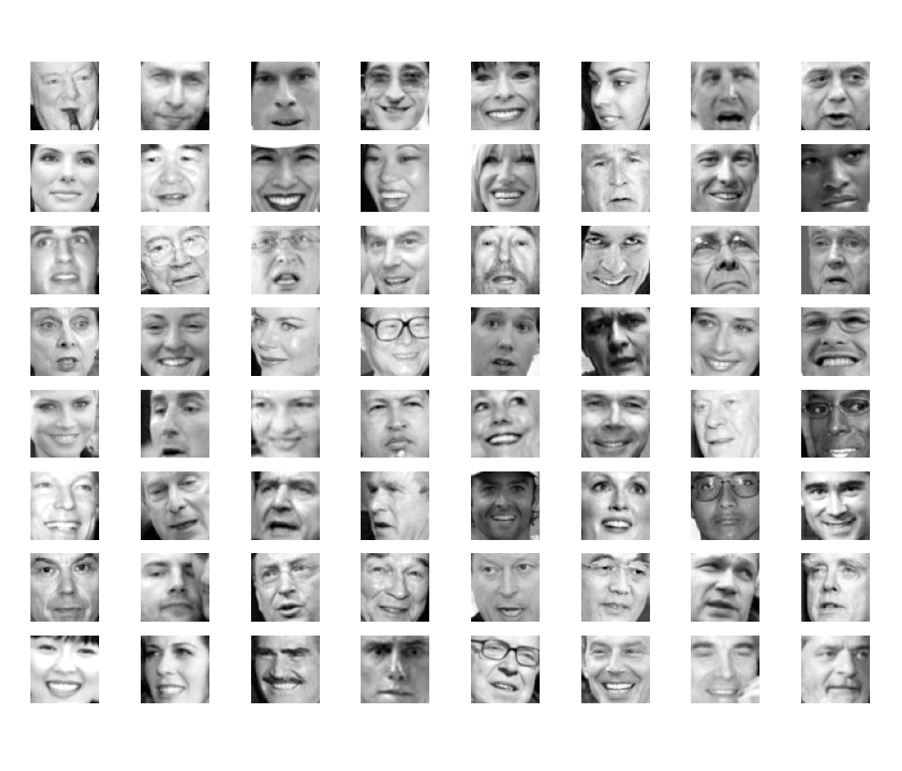
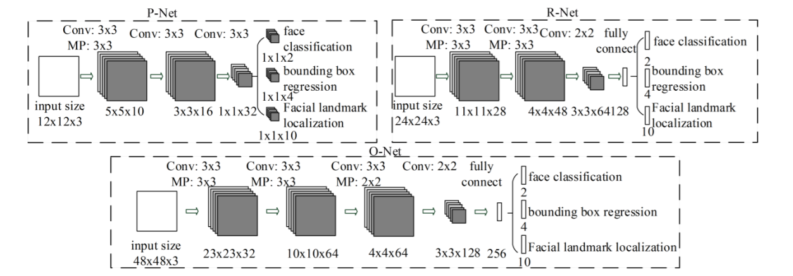
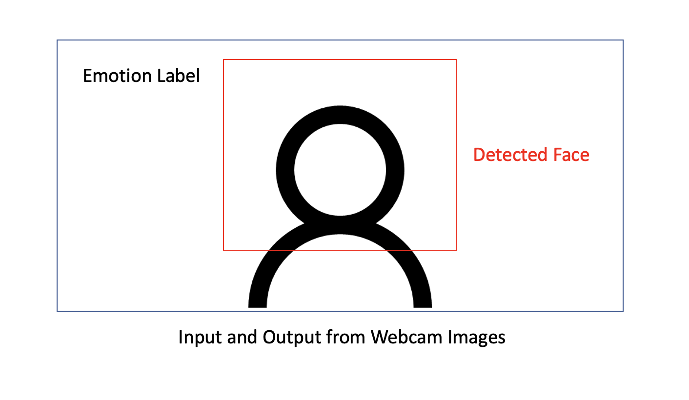

# rEal tiMe objection emOTion rEalizeR - EMOTER

## Motivation

* **Real-Time Deployment** - Work on a project that uses real-time data to predict and analyze to make decisions. 
* **Train-Test Set Inconsistency** - There is a significant gap between the training data and the real-time test data that is used. I aimed to study if this inconsistency would hinder the success of this project.
* **Object Detection** - Use pytorch to use an Object Detection Network in order to identify facial features for emotional detection.
* **Emotional Detection** - Utilize Machine Learning in order to classify emotions on a human.

## Dataset

For this task, I relied on the *SMILEs* dataset which has positive and negative samples of smiling and non-smiling faces. However, the data is purely grayscale images, which is starkly different from the colored images I used during the real-time classification portion. I created a Dataloader for the SMILEs dataset for this project. For the scope of the current project, the dataset only involves binary labels, while it can be extended to other emotiosn as well.

  

## Model Architectures

### Emotion Detector

I initially used the ``resnet18`` and ``resnet34`` architectures for the binary classification task. However, it seemed that the task was vastly overparametrized which led to massive overfitting. In order to fix this issue, I decided to use a simpler approach such a single linear layer with ReLU non-linearity.

### Object Detection

I used a Multi-task Cascaded Convolutional Networks architecture called MTCNN which is an object detection network that is particularly useful for facial recognition. It was very simple to use and had the option of identifying landmarks such as one's eyes, nose, and mouth. I hope to implement this architecture on my own, but for now, I used a pre-trained implementation from ``facenet_pytorch``.

  

## Training

There was not a need to train the SMILEs classifier for too many epochs (max 20), after which it started to attain considerable accuracy. I used the ``Cross Entropy`` loss function and the ``ADAM`` optimizer to train the emotion portion of this project. 

## Running the Code

**Training the Models:**

Run the following command: ``python3 train.py``

**Create real-time image environment and test models:**

Run the following command: ``python3 main.py``

## Findings

### **Some Challenges**
* At first, I was confused as to why the models I were using always predicted my face as not smiling. This was strange because it was attaining consider accuracy (~80%) on the validation set and very high (~90%) accuracy on the training set.

* There was a certain way that I had to transform the real-time images in order to conform to the expectations of the model that would perceive emotion. Experimenting around with the different transformations and eventually arriving at the ones that worked was quite cumbersome.

* Finding a dataset itself that was a difficult task. It might seem surprising, but there were not a lot of reliable facial emotions datasets that I could use. Therefore, I was pushed to use this dataset.

### **Some Fixes**
* I had hopes of using more complicated vision recognition architectures such as Vision Transformers, Deep CNNs, and Perceiver. However, I learned a valuable lesson that "less is more." For this particular case, a simple Multi-Layer Perceptron was an apt choice to get the job done. 

* I found that relying on the torch CenterCrop transform was a good idea to remove all the unnecessary background noise that was not essential in emotion analysis. This also in turn helped increase accuracy and led to more robust results.

* I used the Grayscale transformation to reduce the gap between the train and test sets which seemed to have addressed the train-test set inconsistency issue. 

## Results

This project is able to determine some decently robust binary sentiment classification in the proper settings. The results are limited by the quality of the camera and the amount of noise in the environment. Despite these challenges, EMOTER is able to identify the appropriate emotion and draw a box around the face it is perceiving. The below image is a depiction of the type of output that can be expected. 

  

## Conclusion

With this project, I was able to perform real-time sentiment analysis using a relatively simple, straightforward deep learning model. On top of this, I combined the emotion detector portion with an object detection network to perform real-time face detection. 

## Next Steps

* Extend approach for more emotions than just smiling and not smiling
* Experiment with more robust models that are invariant to environment changes and tackle train-test set inconsistency more effectively
* Implement in-house version of MTCNN instead of pre-trained pytorch implementation

